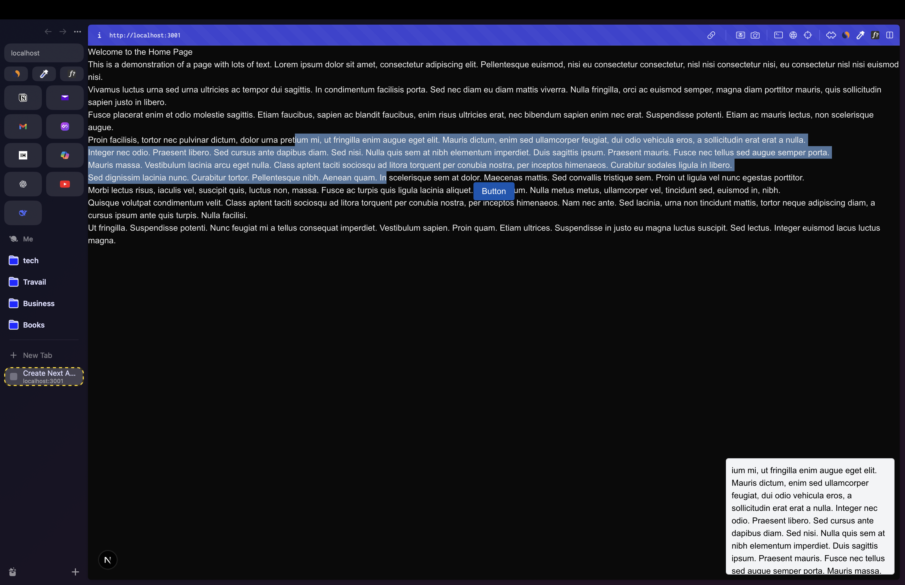

## Project Overview

This project demonstrates how to create a reusable widget and distribute it using Next.js.  
The widget source code is located in the `src/widget` directory.

The widget is built and output to the `public` folder, making it easy to include in any web page.

You can see the widget in action by visiting [http://localhost:3000](http://localhost:3000).  
The widget is loaded on the page via a script tag.

### Embedding the Widget in Another Project

To use the widget in a different project, simply add the following script tag to your HTML:

```bash
<script src="(url)/widget.js" async></script>
```

## Getting Started

install dependency

```bash
 npm i
```

build widget

```bash
 npm run build:widget
```

run the development server:

```bash
 npm run dev
```

Open [http://localhost:3000](http://localhost:3000) with your browser to see the result.


